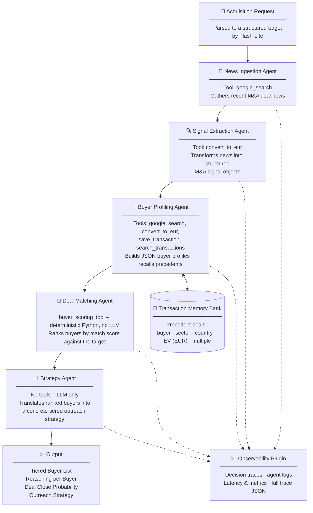

# ⚡ M&A Signal Intelligence Engine
### *Turning Market Chaos into Deal Closing Probability*

---

## 📌 One-Liner

> *An AI multi-agent system that reads real-time market news to identify and rank the most likely buyers for any asset, helping M&A teams to focus on the acquirers who matter.*

---

## 📑 Table of Contents

1. [Problem](#-problem)
2. [Solution](#-solution)
3. [Value](#-value-what-it-delivers)
4. [Quick Start](#-quick-start)
5. [Project Structure](#-project-structure)
6. [Architecture](#-architecture)
7. [Agent Pipeline](#-agent-pipeline)
8. [Memory](#-memory)
9. [Observability](#-observability)
10. [Evaluation](#-evaluation)
11. [Course Concepts Demonstrated](#-course-concepts-demonstrated-6-of-8)
12. [Conclusion](#-conclusion)
13. [Demo Video](#-demo-video)
14. [Competition Details](#-competition-details)
15. [License](#-license)

---

## 🎯 Problem

M&A is fundamentally a **signal interpretation problem under uncertainty**.

Deal teams fail not because they lack buyers, but because:

- They contact **the wrong buyers** at the wrong time
- They rely on **static relationship maps** that do not reflect current strategic shifts
- They **miss real-time signals** – leverage events, portfolio rotations, divestments, and strategic pivots

**The result:** low competitive tension → deals stall → lost fees.

In practice, **poor buyer targeting** is one of the most common reasons deals fall apart,
burning months of hard work, lost fees, and, most importantly, clients' confidence.

This is an **intelligence** problem. **Agents** can solve it.

---

## 💡 Solution

The **M&A Signal Intelligence Engine** is a sequential multi-agent system built with Google ADK and powered by **Gemini 2.5 Flash** (with **Gemini 2.5 Flash-Lite** for fast request parsing). It transforms fragmented market signals into actionable buyer intelligence.

It does not simply summarize news. It answers:

> **"Who is actually likely to buy this asset right now - and why?"**

---

## 💎 Value (What It Delivers)

| Outcome | Description |
|---|---|
| 📈 **Buyer Relevance** | Improved accuracy in identifying the right acquirers for each asset |
| 🎯 **Deal Close Probability** | Higher competitive tension through better buyer targeting |
| 🔇 **Noise Reduction** | Fewer irrelevant outreach contacts wasting deal team bandwidth |
| 🧠 **Decision Intelligence** | Unstructured news transformed into structured, decision-grade output |

---

## 🚀 Quick Start

### Prerequisites

- **Python 3.10+** (developed on 3.11)
- A **Gemini API key** from [Google AI Studio](https://aistudio.google.com/apikey)

### 1. Clone & enter

```bash
git clone https://github.com/YOUR_USERNAME/capstone_project.git
cd capstone_project
```

### 2. Virtual environment

```bash
python3 -m venv .venv
source .venv/bin/activate        # macOS / Linux
# .venv\Scripts\activate         # Windows
```

### 3. Install dependencies

```bash
pip install -r requirements.txt
```

### 4. Configure your API key

```bash
cp .env.template orchestrator/.env
# then edit orchestrator/.env and paste your key:
#   GOOGLE_API_KEY="your_gemini_api_key_here"
```

> ⚠️ **Security:** `orchestrator/.env` is git-ignored — never commit your key.

### 5. Run the pipeline

```bash
# Interactive (no quotes needed):
python3 run.py
#   → Describe the acquisition target (or press Enter for the built-in example):
#   > 500MW solar PV portfolio in Spain

# One-shot (quotes required):
python3 run.py "Find buyers for a distressed German fiber-optic company"
```

**Expected terminal output:**

```
---------------------------------------------------------
M&A SIGNAL INTELLIGENCE ENGINE - PIPELINE SUMMARY
---------------------------------------------------------
Run ID  : run_XXXXXXXX_XXXXXX
Target  : 500MW Solar PV Portfolio
---------------------------------------------------------
  Agent 1 - News Ingestion            signals retrieved
  Agent 2 - Signal Extraction         events classified
  Agent 3 - Buyer Profiling           XX buyer profiles built
  Agent 4 - Deal Matching             XX buyers scored (XX excluded)
    Top buyer: XXX (score: X.X)
  Agent 5 - Strategy                  recommendation generated
---------------------------------------------------------
Google Search calls           XX
Total latency                 XXXXXXms
---------------------------------------------------------
```

After each run, a full trace is saved to `observability/logs/full_trace.json`, and precedent deals accumulate in `memory/transactions.json`.

---

## 🏗️ Architecture

### Pipeline

The system follows a **Signal → Intelligence → Decision** pipeline using five specialized agents orchestrated by an ADK `SequentialAgent` inside an ADK `App`.



### A Hybrid Intelligence

The system deliberately separates two modes of reasoning to maximize reliability:

| Layer | Technology | Purpose |
|---|---|---|
| **Probabilistic** | Gemini 2.5 Flash | Understand news, extract intent, interpret financial language, generate strategy narratives |
| **Deterministic** | Python tools | Score buyers, rank likelihood, apply hard exclusion rules (e.g. weak financial performance, deleveraging mode) |

This hybrid design **avoids hallucinations in financial decision-making**. Gemini handles ambiguity, Python handles the math.

**Note on run-to-run variance:** the recommendation list may differ between
runs, even for the same target. The candidate pool is **live** – it reflects
whatever M&A news the web search surfaces at run time – and the **memory bank
grows with every run**, so buyer profiles become better-informed over time
(richer deal-size ranges and comparable-deal counts). What never varies is the
judgment: given the same buyer profiles, the deterministic scorer always
produces the same ranking.

---

## 📁 Project Structure

```
capstone_project/
│
├── run.py                          ← Entry point (interactive + CLI; Flash-Lite request extraction)
├── requirements.txt                ← Python dependencies
├── .env.template                   ← Copy to orchestrator/.env, then add your key
├── .gitignore
├── LICENSE.md                      ← Apache License 2.0 (full text)
├── NOTICE.md                       ← Attribution notice (Apache 2.0)
│
├── orchestrator/
│   ├── __init__.py
│   ├── agent.py                    ← SequentialAgent + App + Runner + SessionService + plugin + compaction
│   ├── compaction.py               ← TruncatingSummarizer (deterministic context compaction, no LLM)
│   └── .env                        ← API key (git-ignored)
│
├── agents/                         ← Individual agent definitions
│   ├── __init__.py
│   ├── _gate.py                    ← Cost gate (skips dead-end model calls)
│   ├── news_ingestion_agent.py     ← Agent 1: google_search
│   ├── signal_extraction_agent.py  ← Agent 2: M&A signal classification (convert_to_eur)
│   ├── buyer_profiling_agent.py    ← Agent 3: buyer profiles + memory (search/save) + retry loop
│   ├── deal_matching_agent.py      ← Agent 4: deterministic scoring (no LLM)
│   └── strategy_agent.py           ← Agent 5: tiered outreach strategy
│
├── tools/                          ← Custom tool definitions
│   ├── __init__.py
│   ├── buyer_scoring_tool.py       ← Weighted match score + hard exclusion rules
│   └── currency_tool.py            ← Live EUR conversion via ECB daily reference rates
│
├── skills/                         ← Shared prompt utilities
│   ├── __init__.py
│   └── anti_hallucination.py       ← Parametric anti-hallucination rules appended to LLM agents
│
├── memory/                         ← Long-term precedent-deal memory
│   ├── __init__.py
│   ├── transaction_store.py        ← save_transaction / search_transactions (JSON persistence)
│   └── transactions.json           ← Accumulated precedent deals (auto-generated)
│
├── observability/                  ← Logging, tracing, metrics
│   ├── __init__.py
│   ├── tracer.py                   ← PipelineTracer: logging · tracing · metrics
│   ├── tracing_plugin.py           ← ADK plugin wiring the tracer to the App
│   └── logs/full_trace.json        ← Full decision trace per run (auto-generated)
│
├── evals/                          ← Evaluation suite
│   ├── eval_scoring.py             ← Deterministic scoring (no model)
│   ├── eval_parser.py              ← JSON parser robustness (no model)
│   ├── eval_memory.py              ← Long-term memory round-trip (no model)
│   ├── eval_extraction.py          ← Prompt → target extraction (Flash-Lite)
│   └── results/                    ← Timestamped JSON evidence + history.md
│
└── docs/
    ├── user_guide.md               ← Full usage guide
    ├── sample_run.md               ← Annotated end-to-end example run
    └── glossary.md                 ← M&A and pipeline terminology
```

---

## 🤖 Agent Pipeline

### Agent 1 – News Ingestion Agent

| Property | Detail |
|---|---|
| **Type** | `LlmAgent` (Gemini 2.5 Flash) |
| **Tools** | `google_search` (ADK built-in) |
| **Input** | Acquisition target (asset class, sector, country) |
| **Role** | Fetches real-time raw M&A news, press releases, and public announcements relevant to the target |
| **Output** | A concise list of recent M&A deals, covering 8-10 distinct buyers (one item per buyer), passed downstream via conversation context |

---

### Agent 2 – Signal Extraction Agent

| Property | Detail |
|---|---|
| **Type** | `LlmAgent` (Gemini 2.5 Flash, `temperature=0.2`) |
| **Tools** | `convert_to_eur` (custom) |
| **Input** | Raw deal data from Agent 1 |
| **Role** | Transforms unstructured deal data into typed M&A signal objects; converts any non-EUR figures to EUR. Never refuses — if Agent 1 returned no usable deals, it simply says so |
| **Output** | Structured signal objects as **plain text** (one `field: value` block per deal — deliberately not JSON, so downstream agents don't mimic the wrong output shape) |

**Example transformation:**

*Input:* `"A renewable energy platform sells a solar PV portfolio due to high leverage"`

*Output:*
```text
buyer: N/A
seller: Renewable platform
target: solar PV portfolio
target_country: Spain
target_class: renewable_portfolio
target_sector: renewables
event_type: divestment
strategic_driver: high_leverage
urgency: high
multiple: N/A
```

> `target_class` values: `company` · `renewable_portfolio` · `real_estate` · `infra`
> `target_sector` values: one of **18 sectors** (energy, renewables, technology, telecom, healthcare, …) — see [docs/user_guide.md](docs/user_guide.md) §6.

---

### Agent 3 – Buyer Profiling Agent

| Property | Detail |
|---|---|
| **Type** | `LlmAgent` (Gemini 2.5 Flash, `temperature=0.2`, capped thinking budget) — wrapped in an ADK `LoopAgent` that retries once if a flaky model turn returns empty output |
| **Tools** | `google_search`, `convert_to_eur`, `save_transaction`, `search_transactions` |
| **Input** | Structured signals from Agent 2 |
| **Role** | For each buyer, builds a structured profile with financial data and deal history, recalls precedent deals from the memory bank and saves new ones |
| **Output** | Buyer profiles as JSON written to session state (`output_key='buyer_data_raw'`) |

**Buyer Profile Schema (JSON):**

| Field | Type | Description |
|---|---|---|
| `buyer_name` | string | Company name |
| `buyer_type` | enum | `corporate` / `private_equity` / `infrastructure_fund` / `renewable_platform` / `family_office` / `other` |
| `sector_focus` | list | Sectors actively targeted (from the 18-sector taxonomy) |
| `geography_focus` | list | Countries or regions actively invested in |
| `expansion_mode` | enum | `acquiring` / `divesting` / `deleveraging` / `neutral` / `unknown` |
| `financial_capacity` | enum | `strong` / `moderate` / `weak` / `unknown` — measures profitability: weak = negative last-year EBITDA or distress, never just slow growth |
| `leverage_situation` | enum | `low` / `medium` / `high` / `unknown` |
| `min_deal_size_eur_m` | float | Minimum typical transaction size in €M |
| `max_deal_size_eur_m` | float | Maximum typical transaction size in €M |
| `investment_plan_eur_m` | float | Capital the buyer has publicly announced it will deploy in this sector (e.g. a "€2B FTTH plan"), even with no closed acquisitions yet |
| `comparable_deals_count` | int | Number of comparable deals closed in last 5 years |

**Comparable deals:** each profile also carries a `comparable_deals` list per deal: target, country, transaction year, seller, `ev_eur_m`, and (for renewable portfolios) `capacity_mw` / `ev_mw`. These feed the deterministic scorer's MW-based size matching and recency bonus.

---

### Agent 4 – Deal Matching Agent

| Property | Detail |
|---|---|
| **Type** | `BaseAgent` — **no LLM involved** |
| **Tools** | Calls `score_buyer()` and `rank_buyers()` from `buyer_scoring_tool.py` directly as Python functions |
| **Input** | `buyer_data_raw` (parsed JSON) and `target_profile` from session state |
| **Role** | Deterministically scores every buyer against the target, applying hard exclusion rules; returns a ranked list sorted by `match_score` |
| **Output** | `deal_matching_results` (`ranked` + `excluded`) persisted via `EventActions(state_delta=…)` |

**Scoring formula:**

| Dimension | Weight | Logic |
|---|---|---|
| `sector_fit` | 30% | 1.0 if target sector in buyer's focus; 0.5 adjacent, or target sector unknown; 0.1 outside |
| `geography_fit` | 20% | 1.0 if country matches; 0.6 region match; 0.5 target country unknown; 0.1 outside |
| `size_fit` | 20% | 1.0 within the buyer's typical deal size; 0.5 slightly outside or unknown; 0.1 far outside |
| `financial_capacity` | 15% | 1.0 strong; 0.6 moderate; 0.2 weak (also hard-excluded); unknown → deal-activity proxy (see below) |
| `expansion_mode` | 15% | 1.0 acquiring; 0.5 neutral; 0.0 divesting/deleveraging |

#### **Financial capacity:**
Weak = unprofitable (negative last-year EBITDA or distress) – slow or slightly negative growth only makes a profitable buyer `moderate`, never `weak`.

**Size fit logic:** all the asset classes are sized in EUR, except for renewable portfolios (MW capacity if available). Buyers announcing investment plans earn 1.0 if `investment_plan_eur_m` covers the target's size.

**Deal-activity proxy:** used when `financial_capacity` is `unknown`, common for sovereign / private funds whose CAGR can't be computed: `0` deals → 0.2; `1-2` → 0.5; `3-5` → 0.7; `6+` → 0.9. Capped at 0.9 (never a full "strong"), and credited in full only when the buyer also has recent activity.

**Recency bonus:** +0.05 when the buyer's most recent comparable deal closed within the last ~24 months – rewards demonstrated activity and breaks ties between otherwise similar buyers.

**Hard exclusion rules** (buyer removed before ranking if any apply):
- `financial_capacity == 'weak'`
- `expansion_mode == 'deleveraging'`
- `expansion_mode == 'divesting'`

---

### Agent 5 – Strategy Agent

| Property | Detail |
|---|---|
| **Type** | `LlmAgent` (Gemini 2.5 Flash) |
| **Tools** | None — receives the ranked list via prompt injection (`{deal_matching_results}`) |
| **Input** | `deal_matching_results` from session state |
| **Role** | Translates the ranked buyer list into a concrete tiered outreach strategy with deal close probability |
| **Output** | Tiered buyer list with rationale, `deal_close_probability`, and `overall_strategy_note` (plain text, terminal-friendly) |

**Empty-results cost gate:** if deal matching produced zero buyers (no news
found upstream, or buyer profiling failed), a `before_agent_callback` makes this
agent skip its model call and return a clean one-line note instead of
boilerplate. On a normal run the gate is inert. See `agents/_gate.py`.

**Buyer tiers:**

| Tier | Match Score | Action |
|---|---|---|
| Tier 1 | 0.85 – 1.0 | Contact as Tier 1 buyers to build competitive tension |
| Tier 2 | 0.65 – 0.84 | Contact as Tier 2 buyers |
| Tier 3 | 0.4 – 0.64 | Approach selectively as backup buyers |
| Excluded | < 0.4 or hard-excluded | Do not contact |

**Deal close probability:** `high` (≥5 Tier 1) · `medium` (3-4) · `low` (1-2) · `very_low` (no Tier 1).

### 🔗 How agents share data

| Hand-off | Mechanism |
|---|---|
| News → Signal → Buyer Profiling | Conversation context (each agent reads the previous output) |
| Buyer Profiling → Deal Matching | Profiles emitted as **JSON** via `output_key='buyer_data_raw'`, parsed by the matcher |
| Deal Matching → Strategy | Results persisted via `EventActions(state_delta=…)`, injected into the strategy prompt with `{deal_matching_results}` |
| Target into the pipeline | Seeded into session state at startup by `run.py` (`target_profile`) |

---

## 🧠 Memory

The **Transaction Memory Bank** (`memory/transaction_store.py`) is a long-term store of precedent M&A deals that **persists across runs** as JSON.

- **`save_transaction`** – Agent 3 saves each comparable deal it finds (EUR-normalized: buyer, seller, sector, country, EV, class-specific multiple, date, source).
- **`search_transactions`** – Agent 3 recalls precedent deals (filter by buyer / sector / country), returned latest-first, to inform deal-size ranges and comparable counts.

Because the bank compounds over time, every subsequent analysis draws on a richer base of precedents.

---

## 📊 Observability

Observability is implemented as an **ADK plugin** (`observability/tracing_plugin.py`) registered on the `App`, so it fires automatically for **every agent and tool** – the agents themselves carry no observability code. It drives `PipelineTracer` (`observability/tracer.py`), which implements three pillars:

- **Logging** – timestamped event log for every agent start, end, and tool call
- **Tracing** – per-agent decision snapshots capturing key outputs and latency
- **Metrics** – aggregate counters for the full pipeline run

Every run prints a summary and saves a full decision trace to `observability/logs/full_trace.json`:

```json
{
  "run_id": "run_20260628_200224",
  "target_query": "500MW Solar PV Portfolio",
  "pipeline_trace": [
    { "agent": "Agent 1 - News Ingestion", "latency_ms": 4200 },
    { "agent": "Agent 4 - Deal Matching", "latency_ms": 2 }
  ],
  "metrics": {
    "buyers_profiled": 4,
    "buyers_scored": 4,
    "buyers_excluded": 1,
    "top_buyer": "Masdar",
    "top_match_score": 1.0,
    "pipeline_latency_ms": 11872
  }
}
```

---

## ✅ Evaluation

The `evals/` suite validates the system, with each run saving a **timestamped JSON results file** to `evals/results/` (plus a row in `history.md`) as durable evidence.

| Eval | What it checks | Uses model? |
|---|---|---|
| `eval_scoring.py` | Deterministic buyer scoring & ranking, hard exclusions, unknown-size handling | No |
| `eval_parser.py` | The buyer-profile JSON parser (clean / fenced / prose-wrapped / bare-array / truncated / malformed) | No |
| `eval_memory.py` | Long-term memory round-trip (save, filtered search, ordering, validation) | No |
| `eval_extraction.py` | Prompt → structured target (class / sector / country), scored vs an 80% threshold | **Yes** (Flash-Lite) |

Three of the four run **fully offline** (no API, no rate limits). Latest results: all suites **PASS** (scoring 24/24, parser 14/14, memory 8/8, extraction 12/12).

```bash
python3 evals/eval_scoring.py      # free, instant
python3 evals/eval_parser.py       # free, instant
python3 evals/eval_memory.py       # free, instant
python3 evals/eval_extraction.py   # uses Flash-Lite (needs quota)
```

---

## 🧩 Course Concepts Demonstrated (6 of 8)

**1. Multi-Agent Systems** ✅
- 4 LLM agents (`news_ingestion`, `signal_extraction`, `buyer_profiling`, `strategy`)
- 1 custom agent (`DealMatchingAgent` – deterministic `BaseAgent`, no LLM)
- 2 workflow agents (`ma_signal_intelligence_engine` – `SequentialAgent` orchestrating the pipeline; `buyer_profiling_loop` – `LoopAgent` that retries buyer profiling once if a flaky model turn returns empty output)

**2. Tools** ✅
- **Built-in:** `google_search` (real-time M&A news and buyer financial data)
- **Custom (`FunctionTool`):** `convert_to_eur` (live EUR conversion via ECB reference rates), `score_buyer` / `rank_buyers` (deterministic scoring), `save_transaction` / `search_transactions` (memory bank)

**3. Sessions & Memory** ✅
- `InMemorySessionService` + inter-agent state (`output_key`, `EventActions state_delta`, prompt injection)
- **Long-term memory:** `transaction_store.py` persists precedent deals across runs

**4. Context engineering** ✅
- **Context compaction:** deterministic context compaction (`TruncatingSummarizer` via `EventsCompactionConfig`)

**5. Observability** ✅
- Logging · Tracing · Metrics via `PipelineTracer`, wired as an `App` plugin; full trace JSON per run

**6. Agent Evaluation** ✅
- 4-script eval suite (3 offline + 1 model-based) with timestamped, saved evidence

> **Minimum requirement: 3 concepts vs. implemented: 6 ✅**

---

## 🏁 Conclusion

### The Problem

M&A teams often rely on static databases and instinct, which leads to missed buyers, weak outreach, and slower execution. Without timely market intelligence, the time is wasted on players who lack capacity, strategic fit, or current appetite, while the entire process risks leaving value on the table.

### The Solution

The M&A Signal Intelligence Engine automates buyer targeting end to end. It ingests real-time market news, extracts structured M&A signals, builds dynamic buyer profiles, and ranks every potential buyer in a single pipeline run. The output is a tiered outreach strategy grounded in live market data, not static assumptions.

### Value for M&A Teams

Rather than replacing M&A team judgment, the engine amplifies it. It handles the time-intensive work of scanning news, profiling buyers, and scoring fit, so professionals can focus on relationship management and negotiations. With each run, the system becomes smarter as buyer profiles and transaction history accumulate, making future analysis more accurate.

### Key Strengths

**Hybrid intelligence.** Gemini 2.5 Flash handles language understanding, signal interpretation, and strategy narrative. Python handles the math. Scoring is fully deterministic and auditable: given the same buyer profiles, the same evidence always produces the same ranking. The candidate pool itself is live — it reflects the market news at run time, and grows more informed as the memory bank accumulates precedents — so the recommendation list may vary between runs while the judgment behind it never does.

**Persistent transaction memory.** The memory bank compounds across pipeline runs. After multiple asset searches, the engine carries a richer picture of each buyer's sector focus, geographic preferences, and deal frequency, improving targeting accuracy over time.

**Full observability.** Every run produces a structured decision trace with per-agent latency, counts, and buyer scores. There are no black boxes: every recommendation is traceable to its inputs.

**Hallucination guardrails.** Anti-hallucination rules are embedded into every LLM agent's instruction set. Agents are prohibited from inventing financial figures or filling fields with guesses. All data must be sourced from real-time search results or passed explicitly from a prior agent.

**Tested by evaluation.** A dedicated eval suite validates the deterministic core (scoring, JSON parsing, memory) and the model-based extraction, with saved, timestamped evidence for every run.

---

## 🎥 Demo Video

📺 **Watch the Demo on YouTube**

The demo covers:
- The M&A buyer targeting problem and why it matters
- Why a multi-agent architecture is the right solution
- Live pipeline walkthrough with a real asset scenario
- Architecture explanation and key design decisions

*Under 3 minutes.*

---

## 🏆 Competition Details

| Field | Value |
|---|---|
| **Competition** | AI Agents: Intensive Vibe Coding Capstone Project |
| **Track** | Agents for Business |
| **Concepts Implemented** | Multi-Agent Systems · Tools · Sessions & Memory · Context engineering · Observability · Agent Evaluation |
| **Concepts Count** | 6 of 8 (minimum: 3) |
| **Bonus Targets** | ✅ Gemini primary model · ✅ YouTube Demo |

---

## 📄 License

Copyright © 2026 Olga Aksenova.

The code in this repository is licensed under the **Apache License, Version 2.0** – see
[LICENSE.md](LICENSE.md) for the full text and [NOTICE.md](NOTICE.md) for attribution.

---

*Built for AI Agents: Intensive Vibe Coding Capstone Project · Agents for Business *
*Powered by Google ADK · Gemini 2.5 Flash*
